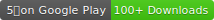
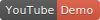

# Teamfight Tactics Cheatsheet App [](https://play.google.com/store/apps/details?id=wu.nick.tft) [](https://www.youtube.com/watch?v=pDBKZgbR0xk)

This is a companion app for Riot's newest game mode: Teamfight Tactics, a League of Legends themed round-based auto battler aka LoL Auto Chess.

Check out the demo on [YouTube](https://www.youtube.com/watch?v=pDBKZgbR0xk) or try it out on [Google Play](https://play.google.com/store/apps/details?id=wu.nick.tft)!

This app is built with `Flutter` and uses `Firebase` for analytics.

## Developing

### Directory Structure

```sh
.
├── assets # Static assets (images, icons, data)
├── lib    # Application code
│   ├── icons       # Generated icons from FlutterIcon.com
│   ├── models      # Data models
│   ├── pages       # Each tab view has its own files
│   │   └── widgets # Reusable widgets
│   └── services    # More business logic
└── test   # Testing code
```

### Creating a New Release

1. Make sure `initialTabIndex` in `main.dart` is set to `0`.
2. If there was a new patch, make sure to update `patches_tab_view.dart`.
3. If there were new champions, make sure to add assets for `splash/champions`, `sprites/abilities`, `sprites/champions`.
4. Bump version in `pubspec.yaml`.
5. Create the new App Bundle by running:

   ```sh
   rm -rf build && flutter build appbundle
   ```

6. Head to Google Play Console `Teamfight Tactics Cheatsheet > Release Management > App releases`to:
    - Upload App Bundle `build/app/outputs/bundle/release/app.aab`, open the folder by running:

        ```sh
        open build/app/outputs/bundle/release/
        ```

    - Add Release Notes
    - Update Store Listing description if needed
